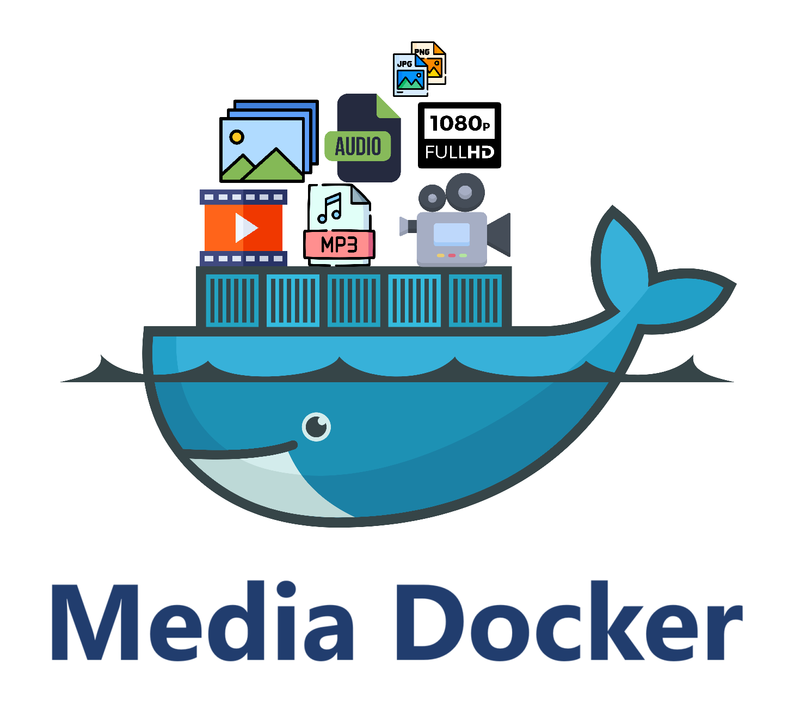

<p align="center">
   
   <p align="center">Streamline Your Media Management: On-Demand Streaming and Scalable Storage with Media-Docker</p>
</p>

# Media-Docker Project - Version 2

**Media-Docker** is a media management service designed to handle video, audio, and image processing with the power of **FFmpeg** for conversion, storage, and on-demand streaming. This version introduces several new components, including a client, server, Kafka-based message queuing, and worker-based message consumption for media processing tasks.

## Note

- This project is created for developers, eliminating the hassle of using third-party services to store critical media files.
- It **_can be deployed on a live server_** as **_all features_** all fully **_operational_**.

---

## Project Structure

- **media-docker-client**: Serves static media assets and processes frontend requests for video streaming, image, and audio retrieval.

- **media-docker-server**: The backend service that handles media upload requests, validating them and sending messages to Kafka for processing.

- **media-docker-kafka**: Manages messages from both the server and consumer, distributing them across Kafka topics to facilitate media processing tasks. It also enables responses from consumers back to the server after conversion.

- **media-docker-kafka-consumer**: Consumes messages from Kafka topics and performs media-related operations, such as creating video segments or converting audio bitrates with **FFmpeg**. This component handles resource-intensive tasks.

## Features

### Video Streaming

- **Media-Docker** utilizes **FFmpeg** to convert uploaded video files into various resolutions (360p, 480p, 720p, 1080p), making them available for on-demand streaming.
- Videos are segmented for seamless playback and adaptive quality streaming, allowing users to switch between different qualities dynamically.

### Audio Processing

- Audio files are stored with the required **bitrate**, as specified by the backend, ensuring flexibility and support for various audio quality needs.
- Dedicated **consumer workers** manage audio processing tasks, ensuring efficient and scalable handling of large media libraries.

### Image Compression

- Images are compressed and stored according to custom **compression settings** provided by the backend service.
- Processing and compression of images are managed by consumer workers, optimizing efficiency and storage.

## Kafka Integration

The **media-docker-kafka** component receives messages for various topics, enabling scalable and asynchronous media processing. The **media-docker-kafka-consumer** executes the primary tasks associated with each topic. Key topics and their respective responsibilities include:

- **video**: Manages video conversion and segmentation tasks.
  
- **videoResolution**: Handles resolution conversion for videos.
  
- **audio**: Processes and stores audio files based on the specified bitrate.
  
- **image**: Manages image compression and storage.
  
- **deleteFile**: Oversees requests for media file deletion.

By leveraging **Kafka** and **FFmpeg**, the project guarantees scalable, efficient media processing with dedicated workers for each topic.

## FFmpeg Integration

- **FFmpeg** serves as the primary tool for converting video and audio files, segmenting videos into streamable parts, adjusting resolutions, and compressing images for storage.

## Usage

After setting up all components, upload media files through the server, which processes the uploads and sends messages to Kafka for various media tasks. Consumers will handle the intensive operations, while the client serves the processed files.

## Contributing

Contributions to Media-Docker are welcome! Please submit a pull request or open an issue for any feature requests or bug reports.

## Conclusion

The **Media-Docker** project, now in version 2, is a complete media processing solution built for scalability and efficiency using **Kafka** workers, **FFmpeg**, and a robust client-server architecture. It supports advanced video streaming, flexible audio processing, and image compression tailored to specific needs, making it an ideal solution for media-heavy applications.

## Installation

- Clone the repository to your local machine.
  ```
  git clone https://github.com/NVJ9SINGHNAVJOT/media-docker.git
  ```
- Set up environment variables.
  In the root directory **.env.example** file is present. Replace it with **.env.client**, **.env.server**, **.env.consumer** file and set the required variables running application _(.env.example contains all variables examples for all envs)_.
- Project can be run on local machine by Docker or by installing dependencies locally.
- **Using Docker**

  ```
  cd media-docker
  docker compose up -d
  ```

- **Using local machine dependencies**

1. Install golang (if not already installed).
2. Install the required modules and components.
3. If you have Apache Kafka installed locally, skip *task dev-kafka* step. Otherwise, start Docker (Apache Kafka is used in this project with Docker)
   ```
   cd media-docker
   task i
   task dev-kafka
   task create-topics-development
   task consumer
   task server
   task client
   ```

- Client will start running at (eg: 7000) 7000 port. [`http://localhost:7000`](http://localhost:7000).
- Server will start running at (eg: 7007) 7007 port. [`http://localhost:7007`](http://localhost:7007).

## Examples

Node.js
   - copy and paste api_node.js.ts file from examples folder to your project
   - eg: api_node.js.ts file is in utils folder in your project

   - video
   ```
   import mediaDocker from "@/utils/api_node_js";

   // upload video
   const video_fileUrl = await mediaDocker.uploadVideo(
      "your_server_key",
      "http://localhost:7007",
      req.file.path
   );
   console.log(video_fileUrl)
   // "http://localhost:7000/media_docker_files/videos/ac9ec121-dad2-48ee-91a5-b9e0e8bcce27/index.m3u8"
   ```

   - image
   ```
   import mediaDocker from "@/utils/api_node_js";

   // upload image
   const image_fileUrl = await mediaDocker.uploadImage(
      "your_server_key",
      "http://localhost:7007",
      req.file.path
   );
   console.log(image_fileUrl)
   // "http://localhost:7000/media_docker_files/images/5f157386-dbf2-46d1-a927-4d837aedbaeb.jpeg"
   ```

## System Design

- [`Open`](https://raw.githubusercontent.com/NVJ9SINGHNAVJOT/media-docker/5fcca46631e9e69bc2f89f0097d55ec4e32561a1/Media-Docker-System-Design.svg)


---

## Important

- Media-Docker utilizes FFmpeg for media file conversion. However, it’s important to note that FFmpeg can be resource-intensive. To optimize performance, consider adjusting your API rate limits and worker pool size based on your system’s available resources.

---


 
