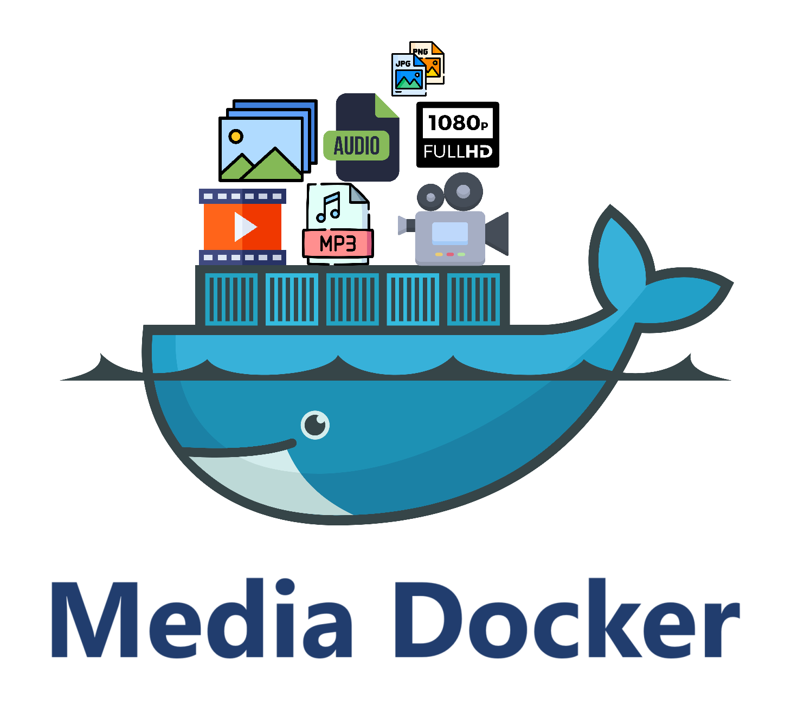

<p align="center">
   
   <p align="center">Streamline Your Media Management: On-Demand Streaming and Scalable Storage with Media-Docker</p>
</p>

# Media-Docker - Version 4

**Version 4** brings two changes.

**Uploads are usable immediately.** The server writes each upload straight into the publicly served
directory and returns a URL that works at once. Until conversion finishes that URL serves the file
exactly as you uploaded it — a video plays right away as a plain progressive download. When the
consumer finishes, the *same URL* starts serving the converted output (an HLS playlist, a compressed
JPEG, an MP3). Nothing on your side changes, because the URL never does. There is no completion
message to wait for and no queue to consume: you no longer have to hold assets in a "pending" state.

**One consumer service per media type.** Conversion is split into dedicated services for video,
video-resolutions, audio and image, plus a lightweight delete service and the failed-job retry
service. Each has its own worker pool, so a backlog of video transcodes can no longer starve image or
audio processing, and each type scales independently.

Two new categories, **`document`** and **`other`**, are stored and served exactly as uploaded with no
conversion at all.

**Media-Docker** is a comprehensive media management platform designed for processing, converting, storing, and streaming media using FFmpeg.

## Note

- This project is created for developers, eliminating the hassle of using third-party services to store critical media files.
- It **_can be deployed on a live server_** as **_all features_** all fully **_operational_**.
- **Whether running one or multiple instances of a consumer service, the total number of workers must not exceed the number of Kafka topic partitions assigned to that service.**
- A conversion that fails permanently no longer breaks an asset: the URL keeps serving the original
  upload, so the file degrades in quality rather than becoming unavailable.

## Acknowledgements

This project uses several open-source libraries, each of which is credited to its respective authors and owners. We would like to extend a big thank you to all the contributors and maintainers of these libraries for their hard work and dedication.

A complete list of the libraries used can be found in the go.mod and go.sum files.

---

## Project Structure

- **media-docker-client**: Resolves each asset's stable URL to whichever representation currently exists, and serves the media files themselves.

- **media-docker-server**: The backend service that handles media upload requests, writes them into media storage, and sends messages to Kafka for processing.

- **media-docker-kafka-cluster**: Manages the flow of messages from the media-docker-server to the consumers by distributing them across Kafka topics. It is internal to media-docker; your backend never connects to it.

- **media-docker-video-consumer**: Converts videos to a single-quality HLS stream with **FFmpeg**.

- **media-docker-video-resolutions-consumer**: Converts videos into the full resolution ladder (360p/480p/720p/1080p) plus an adaptive master playlist. The heaviest job in the system, which is why it scales on its own.

- **media-docker-audio-consumer**: Converts audio to MP3 at the requested bitrate.

- **media-docker-image-consumer**: Compresses images to JPEG.

- **media-docker-delete-consumer**: Removes assets. Deletion is type-agnostic, so one small service handles every media type; it needs no FFmpeg.

- **media-docker-failed-consumer**: Consumes messages from the **_failed-letter-queue_** (which acts as the dead-letter queue in this project) and retries them. It re-runs the very same handlers the primary consumers use, so the retry path cannot drift from the original.

- **mediaDocker module (in the \_examples folder for backend servers, according to language)**: Contains the core logic for uploading files to the Media-Docker service. It talks to the server over plain HTTP and has no third-party dependencies. `_examples/app/` holds a runnable demo that uses it — see [\_examples/README.md](./_examples/README.md).

## Features

### Video Streaming

- **Media-Docker** utilizes **FFmpeg** to convert uploaded video files into various resolutions (360p, 480p, 720p, 1080p), making them available for on-demand streaming.
- Videos are segmented for seamless playback, and a **master playlist** is generated so players can switch quality dynamically on their own.
- The video URL is playable before conversion has even started, serving your original upload until the HLS stream is ready.

### Audio Processing

- Audio files are stored with the required **bitrate**, as specified by the backend, ensuring flexibility and support for various audio quality needs.
- A dedicated consumer service handles audio, with its own worker pool.

### Image Compression

- Images are compressed and stored according to the **compression** level provided by the backend service (1 = best quality, 31 = smallest, matching FFmpeg's `-q:v`).
- A dedicated consumer service handles images, with its own worker pool.

### Documents and Other Files

- **document** (PDF, Office formats, text) and **other** (anything else) are stored and served exactly as uploaded, with no conversion and no consumer involved.
- Both are always served as downloads with `Content-Disposition: attachment` and `X-Content-Type-Options: nosniff`, so an uploaded HTML or SVG file cannot execute on the serving origin.

## Kafka Integration

The media-docker-kafka-cluster component leverages a Kafka cluster with 3 brokers in KRaft mode to receive messages from different topics, promoting scalable and asynchronous media processing. Each topic is owned by exactly one consumer service:

| Topic | Owned by | Responsibility |
| --- | --- | --- |
| **video** | media-docker-video-consumer | Video conversion and segmentation |
| **video-resolutions** | media-docker-video-resolutions-consumer | Resolution ladder and master playlist |
| **audio** | media-docker-audio-consumer | Audio conversion at the specified bitrate |
| **image** | media-docker-image-consumer | Image compression and storage |
| **delete-file** | media-docker-delete-consumer | Asset deletion, for every media type |
| **failed-letter-queue** | media-docker-failed-consumer | Retry mechanism for failed jobs |

`document` and `other` have no topics: they need no processing, so the server completes them itself.

Every topic is internal. Your backend integrates over HTTP only and never connects to Kafka.

By leveraging **Kafka** and **FFmpeg**, the project guarantees scalable, efficient media processing with a dedicated worker pool per media type.

## FFmpeg Integration

- **FFmpeg** serves as the primary tool for converting video and audio files, segmenting videos into streamable parts, adjusting resolutions, and compressing images for storage.

## Contributing

Contributions to Media-Docker are always welcome! To submit feature requests, report bugs, or contribute to the project, please open an issue or submit a pull request. For guidelines on contributing and maintaining the project, refer to the [CODE_OF_CONDUCT.md](https://github.com/NVJ9SINGHNAVJOT/media-docker/blob/main/CODE_OF_CONDUCT.md) and [CONTRIBUTING.md](https://github.com/NVJ9SINGHNAVJOT/media-docker/blob/main/CONTRIBUTING.md) files.

## Conclusion

The **Media-Docker** project, now in version 4, is a complete media processing solution built for scalability and efficiency using **Kafka** workers, **FFmpeg**, and a robust client-server architecture. It supports advanced video streaming, flexible audio processing, image compression, and plain storage for documents and arbitrary files — with URLs that are usable the moment an upload finishes and a dedicated, independently scalable consumer service per media type.

For a deeper look at the design, see [docs/architecture.md](./docs/architecture.md),
[docs/systemdesign.md](./docs/systemdesign.md), [docs/project-flow.md](./docs/project-flow.md) and
[docs/folderstructure.md](./docs/folderstructure.md). Upgrading from v3? See the migration notes at
the end of [docs/project-flow.md](./docs/project-flow.md).

## Installation

- Clone the repository to your local machine.
  ```sh
  git clone https://github.com/NVJ9SINGHNAVJOT/media-docker.git
  ```
- Set up environment variables.
  In the root directory, you will find the **.env.example** file. Replace it with the following files:
  - **.env.client**
  - **.env.server**
  - **.env.video**
  - **.env.video-resolutions**
  - **.env.audio**
  - **.env.image**
  - **.env.delete**
  - **.env.failed**

  _**.env.example** file contains example values for all the environment variables._

  Ensure that you set the required variables for each application. Each consumer file needs only three
  variables: `ENVIRONMENT`, `KAFKA_BROKERS` and `KAFKA_WORKERS`.
- When configuring `KAFKA_WORKERS`, ensure the total does not exceed the number of partitions for that service's topic. Exceeding the partition count will result in idle workers. Additionally, if you're running multiple instances of a consumer service, the combined total across all instances should also not exceed the partition count for that topic.
- Size `.env.video-resolutions` against CPU cores rather than partitions: each message there is four
  transcodes, so it does roughly four times the work per message that the video consumer does.

- Project can be run on local machine by Docker or by installing dependencies locally.
- **Using Docker:** **_Recommended for Production_**

  ```sh
  cd media-docker
  task compose-up
  ```

- **Using local machine dependencies:** **_Recommended for Development_**

1. Install [golang](https://go.dev) (if not already installed).
2. Install [ffmpeg](https://www.ffmpeg.org) (if not already installed).
3. If you have Apache Kafka installed locally, skip the _task dev-kafka_ and _task dev-kafka-topics_ steps, and create the topics as described in the _this_create_kafka_topics.sh_ file. Otherwise, start Docker (Apache Kafka is used in this project with Docker) and execute the following task commands:

   ```sh
   cd media-docker
   task i
   task dev-kafka
   task dev-kafka-topics

   # Below tasks need to run in different terminals:
   task server
   task client
   task video
   task video-resolutions
   task audio
   task image
   task delete
   task failed
   ```

   You only need the consumers for the media types you are actually exercising.

- Client will start running at (eg: 7000) 7000 port. [`http://localhost:7000`](http://localhost:7000).
- Server will start running at (eg: 7007) 7007 port. [`http://localhost:7007`](http://localhost:7007).

- You can execute the **_task_** command in the terminal to view all the available commands in the task file.

---
## Usage

After setting up all components, upload media files through the server, which stores the uploads and sends messages to Kafka for various media tasks. Consumers handle the intensive operations, while the client serves the files.

### Using the returned URL

The `fileUrl` you get back works immediately — store it and serve it straight away. Behind it, the
client resolves each request to the best representation that exists at that moment:

```
GET /media/videos/<id>
    before conversion  →  302  →  /media_docker_files/videos/<id>/original.mp4
    after  conversion  →  302  →  /media_docker_files/videos/<id>/hls/index.m3u8
```

The URL itself never changes, so nothing in your database or your frontend needs updating when
conversion completes — and nothing has to be notified that it did. If conversion never succeeds the
URL keeps serving your original upload indefinitely — degraded, not broken.

### Network

- Docker Network Connection: When running your backend server inside Docker, use the media-docker-proxy network to connect it to the media-docker service. This ensures secure and internal communication between services.

- Backend Service Configuration: In your backend service's Docker configuration, make sure to add the media-docker-proxy network under the networks section. This network is dedicated specifically to the media-docker service, facilitating communication between your backend and the media-docker services within Docker.

- Local Development: If your backend service is running locally (outside of Docker), you can also run the media-docker services locally. In this case, use localhost in your media docker module configuration to connect to the services.

### Configuration Parameters

Set the following configuration parameters in the media docker module:

- mediaDockerServerBaseURL:
```ts
"http://localhost:7007" | "http://media-docker-server:7007"
```
The base URL for the media server API. Use localhost for development and media-docker-server for Docker or production environments.

## Examples

### Node.js Integration

- Copy `_examples/nodejs/mediaDocker.ts` into your project.
- Example: Place the file in the utils folder of your project.
- The module has no third-party dependencies — there is nothing to install.
- To see it working first, run the demo: `cd _examples && MEDIA_DOCKER_SERVER_KEY=your_server_key npm start`

- First connect to media-docker-server

```ts
import mediaDocker from "@/utils/mediaDocker";

// First, connect to the media-docker-server
async function connectToMediaDocker() {
  try {
    // Authenticate against the Media-Docker server.
    // The connect function requires two parameters:
    // 1. mediaDockerServerKey: A string representing the API key for the media server (e.g., "your_server_key").
    // 2. mediaDockerServerBaseURL: The URL for the Media-Docker server.
    //    Use "http://localhost:7007" for development or "http://media-docker-server:7007" when using Docker.
    //
    // This is the only handshake there is. Nothing is held open afterwards, so there is
    // no connection to manage and nothing to disconnect.

    await mediaDocker.connect(
      "YOUR_SERVER_API_KEY",
      "http://localhost:7007" // Use "http://media-docker-server:7007" when in Docker
    );
  } catch (error) {
    console.error("Error connecting to Media-Docker:", error);
  }
}
```

- video

```ts
import mediaDocker from "@/utils/mediaDocker";

// upload video
const result = await mediaDocker.uploadVideo("/path/to/video.mp4", 80);

console.log(result);
// {
//     "message": "video uploaded successfully",
//     "data": {
//         "id": "5d71228e-bff9-44a5-b949-f8e5a32b95a4",
//         "fileUrl": "http://example.com/media/videos/5d71228e-bff9-44a5-b949-f8e5a32b95a4"
//     }
// }
// This URL is playable right now. It serves your uploaded file until the HLS
// stream is ready, then serves the stream — at the same address.
```

- video resolutions

```ts
import mediaDocker from "@/utils/mediaDocker";

// upload video resolutions
const result = await mediaDocker.uploadVideoResolutions("/path/to/video.mp4");

console.log(result);
// {
//     "message": "video uploaded successfully",
//     "data": {
//         "id": "8a39e8c1-e0fb-4d34-9719-58ac2cb2f3b0",
//         // Prefer this one: once converted it serves a master playlist and the
//         // player picks a quality on its own.
//         "fileUrl": "http://example.com/media/videos/8a39e8c1-e0fb-4d34-9719-58ac2cb2f3b0",
//         "fileUrls": {
//             "360": "http://example.com/media/videos/8a39e8c1-e0fb-4d34-9719-58ac2cb2f3b0/360",
//             "480": "http://example.com/media/videos/8a39e8c1-e0fb-4d34-9719-58ac2cb2f3b0/480",
//             "720": "http://example.com/media/videos/8a39e8c1-e0fb-4d34-9719-58ac2cb2f3b0/720",
//             "1080": "http://example.com/media/videos/8a39e8c1-e0fb-4d34-9719-58ac2cb2f3b0/1080"
//         }
//     }
// }
```

- audio

```ts
import mediaDocker from "@/utils/mediaDocker";

// upload audio
const result = await mediaDocker.uploadAudio("/path/to/audio.wav", "192k");

console.log(result);
// {
//   "message": "audio uploaded and processed successfully",
//   "data": {
//       "id": "3ef614d5-8d1c-4e2d-a463-dc412f31dc46",
//       "fileUrl": "http://example.com/media/audios/3ef614d5-8d1c-4e2d-a463-dc412f31dc46"
//   }
// }
```

- image

```ts
import mediaDocker from "@/utils/mediaDocker";

// upload image, optionally with a compression level (1 = best, 31 = smallest)
const result = await mediaDocker.uploadImage("/path/to/image.png", 3);

console.log(result);
// {
//   "message": "image uploaded successfully",
//   "data": {
//       "id": "2321155f-af55-4819-b5b4-0bf667086a18",
//       "fileUrl": "http://example.com/media/images/2321155f-af55-4819-b5b4-0bf667086a18"
//   }
// }
```

- document and other

```ts
import mediaDocker from "@/utils/mediaDocker";

// Stored and served exactly as uploaded — no conversion, no consumer involved.
// The URL is final the moment the upload completes.
const doc = await mediaDocker.uploadDocument("/path/to/report.pdf");
const any = await mediaDocker.uploadOther("/path/to/archive.zip");

console.log(doc);
// {
//   "message": "document uploaded successfully",
//   "data": {
//       "id": "b1f2c3d4-1234-4a5b-9c8d-7e6f5a4b3c2d",
//       "fileUrl": "http://example.com/media/documents/b1f2c3d4-1234-4a5b-9c8d-7e6f5a4b3c2d"
//   }
// }
// Both are always served as downloads, never rendered inline.
```

## System Design

- [`Open`](https://raw.githubusercontent.com/NVJ9SINGHNAVJOT/media-docker/ca232547406e93d7533c938057ffe1f7ae702847/Media-Docker-System-Design.svg)

  

## Important

- Media-Docker utilizes FFmpeg for media file conversion. However, it’s important to note that FFmpeg can be resource-intensive. To optimize performance, consider adjusting your API rate limits and worker pool size based on your system’s available resources.

---
