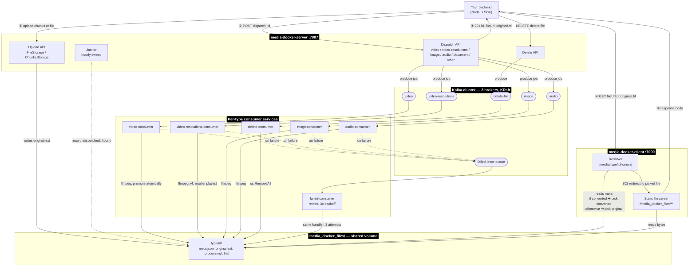

# System Diagram

Every component and every data path in one picture: uploads, dispatch, the Kafka topics, the six
consumer services, the shared storage volume, the resolver, and the DLQ retry path. Complements
[architecture.md](./architecture.md) (what the pieces are), [systemdesign.md](./systemdesign.md)
(why they're built this way) and [project-flow.md](./project-flow.md) (per-flow detail).

Dotted edges are failure paths. Circled numbers trace the happy path from
[project-flow.md](./project-flow.md) section 1, in order.

Two things this makes visible that the tables in the other docs don't: every consumer writes only to
the shared `media_docker_files` volume, never back through Kafka, and the failed-consumer is the only
service that reads from `failed-letter-queue` — nothing else in the diagram depends on it being up.
